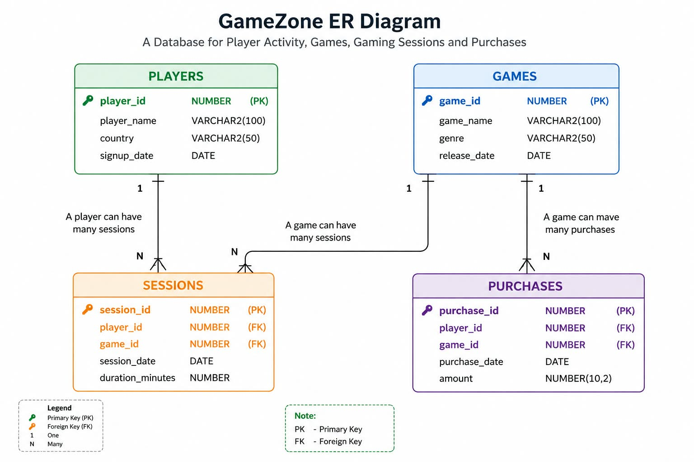

#  GameZone – SQL Data Analysis Project

##  Project Overview

**GameZone** is a SQL-based data analysis project built around a fictional gaming platform.

The project analyzes **players, games, gaming sessions, and purchases** to understand player engagement, game popularity, and revenue performance.

The database was designed and populated from scratch using **Oracle SQL**, making this a fully SQL-focused project.

---

##  Objectives

- Analyze player gaming activity.
- Identify popular and high-revenue games.
- Analyze revenue by game and genre.
- Identify high-value and active players.
- Apply SQL joins, aggregations, subqueries, CTEs, and window functions.
- Generate business-oriented insights from the data.

---

##  Database Structure

The database contains four main tables:

| Table | Description |
|---|---|
| `PLAYERS` | Player information |
| `GAMES` | Game details and genres |
| `SESSIONS` | Player gaming sessions |
| `PURCHASES` | Player purchases and revenue |

### ER Diagram



---

## 🛠️ Tools & Technologies

- **Oracle Database 11g**
- **SQL / SQL*Plus**
- **GitHub**

---

## 🔍 SQL Analysis

The project contains **15 SQL analysis questions** divided into three levels:

### 🟢 Simple
Basic filtering, sorting, aggregation, and grouping.

### 🟡 Medium
Joins, subqueries, `HAVING`, `CASE`, and multi-table analysis.

### 🔴 Advanced
CTEs, ranking functions, window functions, `PARTITION BY`, and cumulative calculations.

The complete questions and solutions are available in:

`gamezone_Q&A.txt`

---

## 📊 Visualizations

The SQL analysis was used to create four key visualizations:

- 💰 Revenue by Game
- 🎮 Sessions by Game
- 🎯 Revenue by Genre
- 📈 Cumulative Revenue Over Time

These visualizations are based directly on the results generated from the SQL database.

---

## 💡 Key Findings

- **Galaxy Warriors** generated the highest revenue at **₹4,245**.
- **Battle Arena** recorded the highest number of sessions with **7 sessions**.
- **Action** was the highest-revenue genre, generating **₹7,238**.
- Cumulative platform revenue reached **₹14,570** during the analysis period.

An interesting observation is that the **most-played game was not the highest-revenue game**, showing why both engagement and revenue metrics are important.

---

## 🚀 Future Development

The current database provides a foundation that can be expanded with additional gaming functionalities such as:

- Player progression and achievements
- Game ratings and reviews
- Multiplayer match tracking
- Rewards and subscriptions
- Player retention and churn analysis
- In-game purchase tracking

The existing `Players`, `Games`, `Sessions`, and `Purchases` structure can serve as the foundation for these future enhancements.

---

## 📁 Project Structure

```text
GameZone-SQL-Analysis/
│
├── README.md
├── ER_Diagram.jpeg
│
├── sql/
│   ├── 01_database_setup.sql
│   ├── 02_data_insertion.sql
│   └── 03_gamezone_Q&A.sql
│
└── visualizations/
    ├── revenue_by_game.jpeg
    ├── sessions_by_game.jpeg
    ├── revenue_by_genre.jpeg
    └── cumulative_revenue.jpeg
```

## 👤 Author

Soumya
